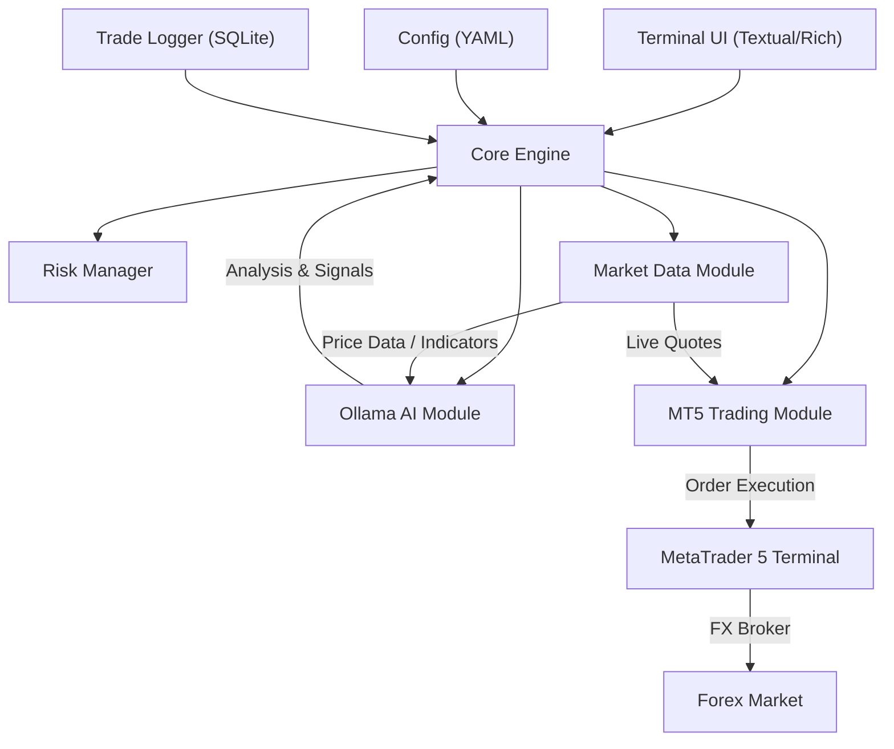

# Tradeform — AI-Powered Terminal Forex Trader

An intelligent terminal-based trading system that connects local Ollama LLMs with MetaTrader 5 for AI-driven forex market trading.

## Architecture Overview



---

## User Review Required

> [!IMPORTANT]
> **Broker & MT5 Setup**: This system requires MetaTrader 5 to be installed and logged into your FX broker account on the same Windows machine. The Python `MetaTrader5` package connects to the running MT5 terminal.

> [!WARNING]
> **Live Trading Risk**: This system will execute real trades on your broker account. We will implement safety features (max drawdown limits, position size caps, kill switch), but you must always monitor the system. We'll start with a **demo/paper trading mode** by default.

---

## Open Questions

> [!IMPORTANT]
> 1. **Which Ollama model(s) do you want to use?** (e.g., `llama3.2`, `mistral`, `deepseek-coder`, `qwen2.5`). Different models have different strengths for financial analysis.
> 2. **Which FX broker are you using?** (e.g., IC Markets, Pepperstone, OANDA, XM). This affects symbol naming conventions (e.g., `EURUSD` vs `EURUSD.r`).
> 3. **Which currency pairs do you want to trade?** (e.g., EURUSD, GBPUSD, XAUUSD/Gold).
> 4. **What's your risk tolerance?** (max lot size, max % risk per trade, max daily drawdown).
> 5. **Trading style preference?** (scalping on M1/M5, swing trading on H1/H4, or should the AI decide?).
> 6. **Do you want the AI to auto-execute trades or just suggest signals that you confirm?** (Auto mode vs Confirmation mode).

---

## Proposed Changes

### Project Structure

```
Tradeform/
├── aim.md
├── requirements.txt
├── config.yaml                  # User configuration
├── main.py                      # Entry point
├── tradeform/
│   ├── __init__.py
│   ├── app.py                   # Textual TUI Application
│   ├── config.py                # Config loader & validator
│   ├── core/
│   │   ├── __init__.py
│   │   ├── engine.py            # Main trading engine (orchestrator)
│   │   └── events.py            # Event system for module communication
│   ├── ai/
│   │   ├── __init__.py
│   │   ├── ollama_client.py     # Ollama connection & model management
│   │   ├── analyst.py           # Market analysis prompts & reasoning
│   │   └── prompts.py           # System prompts & templates
│   ├── mt5/
│   │   ├── __init__.py
│   │   ├── connection.py        # MT5 terminal connection manager
│   │   ├── data.py              # Market data fetcher (OHLCV, ticks)
│   │   ├── trader.py            # Order execution (buy/sell/modify/close)
│   │   └── symbols.py           # Symbol info & normalization
│   ├── risk/
│   │   ├── __init__.py
│   │   └── manager.py           # Position sizing, drawdown limits, kill switch
│   ├── indicators/
│   │   ├── __init__.py
│   │   └── technical.py         # Technical indicators (RSI, MACD, EMA, ATR, etc.)
│   ├── ui/
│   │   ├── __init__.py
│   │   ├── dashboard.py         # Main dashboard screen
│   │   ├── trade_panel.py       # Active trades & history panel
│   │   ├── ai_panel.py          # AI analysis & chat panel
│   │   ├── chart.py             # ASCII price chart widget
│   │   └── styles.tcss          # Textual CSS styling
│   └── storage/
│       ├── __init__.py
│       └── logger.py            # SQLite trade journal & performance log
└── tests/
    ├── test_mt5.py
    ├── test_ai.py
    └── test_risk.py
```

---

### 1. Terminal UI (Textual + Rich)

#### [NEW] [app.py](file:///c:/Users/kalvi/OneDrive/Documents/VS/Tradeform/tradeform/app.py)
- Main Textual application class
- Dashboard layout with multiple panels:
  - **Header**: Connection status (MT5 ✅, Ollama ✅), account balance, equity, margin
  - **Market Panel** (left): Live price quotes, spread, daily change for watched symbols
  - **AI Panel** (center): AI analysis output, reasoning, signal suggestions with streaming display
  - **Trade Panel** (right): Open positions with P/L, pending orders
  - **Chart Panel** (bottom-left): ASCII candlestick chart of selected symbol
  - **Log Panel** (bottom-right): System logs, trade execution confirmations
  - **Command Bar** (footer): Interactive command input for manual overrides
- Keyboard shortcuts: `q` quit, `t` manual trade, `a` trigger AI analysis, `k` kill switch (close all)

#### [NEW] [styles.tcss](file:///c:/Users/kalvi/OneDrive/Documents/VS/Tradeform/tradeform/ui/styles.tcss)
- Dark theme with trading-appropriate colors (green/red for P/L, cyan for info)
- Panel borders, spacing, responsive layout

#### [NEW] [dashboard.py](file:///c:/Users/kalvi/OneDrive/Documents/VS/Tradeform/tradeform/ui/dashboard.py)
- Dashboard screen composing all panels
- Real-time update workers (refreshing every 1-2 seconds)

#### [NEW] [chart.py](file:///c:/Users/kalvi/OneDrive/Documents/VS/Tradeform/tradeform/ui/chart.py)
- ASCII candlestick chart using Unicode block characters
- Shows last N candles for the selected timeframe

#### [NEW] [trade_panel.py](file:///c:/Users/kalvi/OneDrive/Documents/VS/Tradeform/tradeform/ui/trade_panel.py)
- DataTable widget showing open positions with real-time P/L updates
- Trade history table

#### [NEW] [ai_panel.py](file:///c:/Users/kalvi/OneDrive/Documents/VS/Tradeform/tradeform/ui/ai_panel.py)
- Scrollable panel showing AI analysis output with streaming tokens
- Signal cards (BUY/SELL/HOLD) with confidence levels
- Interactive chat input for ad-hoc questions to the AI

---

### 2. Ollama AI Module

#### [NEW] [ollama_client.py](file:///c:/Users/kalvi/OneDrive/Documents/VS/Tradeform/tradeform/ai/ollama_client.py)
- Connect to local Ollama instance (`http://localhost:11434`)
- List available models, verify selected model is pulled
- Chat completion with streaming support
- Conversation history management for context-aware analysis
- Timeout handling and reconnection logic

#### [NEW] [analyst.py](file:///c:/Users/kalvi/OneDrive/Documents/VS/Tradeform/tradeform/ai/analyst.py)
- **Market Analysis Pipeline**:
  1. Fetch current price data + technical indicators for target symbol
  2. Format data into a structured prompt
  3. Send to Ollama model for analysis
  4. Parse AI response into a structured `TradeSignal` (direction, confidence, entry, SL, TP)
- Analysis modes:
  - **Scheduled**: Auto-analyze every N minutes / on new candle close
  - **On-demand**: User triggers analysis manually
- Multi-timeframe analysis support (e.g., check H4 trend, trade on M15)

#### [NEW] [prompts.py](file:///c:/Users/kalvi/OneDrive/Documents/VS/Tradeform/tradeform/ai/prompts.py)
- System prompt: Define the AI's role as a professional forex analyst
- Analysis prompt template: Include OHLCV data, indicators, current positions, account state
- Signal format: Enforce structured JSON output from the model
- Risk assessment prompt: Evaluate current exposure before new trades

---

### 3. MetaTrader 5 Trading Module

#### [NEW] [connection.py](file:///c:/Users/kalvi/OneDrive/Documents/VS/Tradeform/tradeform/mt5/connection.py)
- Initialize MT5 terminal connection
- Login with credentials from config
- Health check / heartbeat
- Graceful shutdown

#### [NEW] [data.py](file:///c:/Users/kalvi/OneDrive/Documents/VS/Tradeform/tradeform/mt5/data.py)
- Fetch OHLCV bars (`copy_rates_from_pos`)
- Fetch live tick data (`symbol_info_tick`)
- Account info (balance, equity, margin, free margin)
- Open positions list
- Trade history

#### [NEW] [trader.py](file:///c:/Users/kalvi/OneDrive/Documents/VS/Tradeform/tradeform/mt5/trader.py)
- **Open position**: Market buy/sell with SL/TP
- **Modify position**: Update SL/TP (trailing stop)
- **Close position**: Close by ticket or close all
- **Pending orders**: Limit/Stop orders
- Order validation before sending
- Slippage handling
- Error code interpretation and retry logic

#### [NEW] [symbols.py](file:///c:/Users/kalvi/OneDrive/Documents/VS/Tradeform/tradeform/mt5/symbols.py)
- Symbol information (digits, point, lot step, min/max lot)
- Symbol name normalization (handle broker suffixes like `.r`, `.m`, etc.)
- Market hours / session check

---

### 4. Risk Management

#### [NEW] [manager.py](file:///c:/Users/kalvi/OneDrive/Documents/VS/Tradeform/tradeform/risk/manager.py)
- **Position sizing**: Calculate lot size based on account balance, risk %, and stop loss distance
- **Drawdown guard**: Track daily P/L, halt trading if max daily loss exceeded
- **Exposure limits**: Max positions per symbol, max total exposure
- **Kill switch**: Emergency close all positions
- **Trade validation**: Check all risk rules before allowing order execution
- **Correlation check**: Prevent overexposure to correlated pairs (e.g., EURUSD + GBPUSD both long)

---

### 5. Technical Indicators

#### [NEW] [technical.py](file:///c:/Users/kalvi/OneDrive/Documents/VS/Tradeform/tradeform/indicators/technical.py)
- Pure Python/NumPy implementations (no TA-Lib dependency):
  - RSI (Relative Strength Index)
  - MACD (Moving Average Convergence Divergence)
  - EMA / SMA (Exponential / Simple Moving Average)
  - ATR (Average True Range) — for dynamic SL/TP
  - Bollinger Bands
  - Support/Resistance levels
  - Volume analysis
- Returns structured dict ready for AI prompt injection

---

### 6. Configuration & Storage

#### [NEW] [config.yaml](file:///c:/Users/kalvi/OneDrive/Documents/VS/Tradeform/config.yaml)
```yaml
mt5:
  login: 12345678
  password: "your_password"
  server: "YourBroker-Server"
  path: "C:/Program Files/MetaTrader 5/terminal64.exe"  # optional

ollama:
  host: "http://localhost:11434"
  model: "llama3.2"
  temperature: 0.3
  analysis_interval_minutes: 5

trading:
  symbols: ["EURUSD", "GBPUSD", "USDJPY"]
  timeframe: "M15"
  mode: "confirmation"  # "auto" or "confirmation"
  
risk:
  max_risk_per_trade_pct: 1.0
  max_daily_drawdown_pct: 3.0
  max_positions: 3
  max_lot_size: 0.5
  default_sl_atr_multiplier: 1.5
  default_tp_atr_multiplier: 2.5
```

#### [NEW] [logger.py](file:///c:/Users/kalvi/OneDrive/Documents/VS/Tradeform/tradeform/storage/logger.py)
- SQLite database for trade journal
- Tables: trades, ai_analyses, daily_performance
- Query methods for performance metrics (win rate, profit factor, expectancy)

---

### 7. Core Engine

#### [NEW] [engine.py](file:///c:/Users/kalvi/OneDrive/Documents/VS/Tradeform/tradeform/core/engine.py)
- **Orchestrator** that ties all modules together
- Main loop:
  1. Check MT5 connection health
  2. Fetch latest market data
  3. Compute technical indicators
  4. On schedule: Send to AI for analysis
  5. If signal received → validate through risk manager → execute or present for confirmation
  6. Monitor open positions (trailing SL, break-even)
  7. Update UI panels
- Event-driven architecture using async workers

#### [NEW] [events.py](file:///c:/Users/kalvi/OneDrive/Documents/VS/Tradeform/tradeform/core/events.py)
- Custom event types: `NewSignal`, `TradeExecuted`, `AnalysisComplete`, `RiskAlert`
- Pub/sub pattern for decoupled module communication

---

## Tech Stack

| Component | Technology | Purpose |
|-----------|-----------|---------|
| Language | Python 3.11+ | Core runtime |
| Terminal UI | Textual + Rich | Beautiful TUI dashboard |
| AI | Ollama Python SDK | Local LLM inference |
| Trading | MetaTrader5 package | Broker connection & execution |
| Data | pandas + numpy | Market data processing |
| Indicators | numpy (custom) | Technical analysis |
| Config | PyYAML | Configuration management |
| Storage | SQLite3 (built-in) | Trade journal |
| Scheduling | asyncio | Async task scheduling |

### Dependencies (`requirements.txt`)
```
MetaTrader5>=5.0.45
ollama>=0.4.0
textual>=3.0.0
rich>=13.0.0
pandas>=2.0.0
numpy>=1.24.0
pyyaml>=6.0
```

---

## Development Phases

### Phase 1 — Foundation (First Build)
1. Project setup, config loader, requirements
2. MT5 connection module (connect, fetch data, account info)
3. Ollama client (connect, list models, basic chat)
4. Basic terminal UI (dashboard skeleton with panels)
5. Wire up: display live market data in UI

### Phase 2 — AI Analysis
6. Technical indicators module
7. AI analyst with structured prompts
8. Signal parsing and display in AI panel
9. Scheduled analysis loop

### Phase 3 — Trade Execution
10. Order execution module (buy/sell/modify/close)
11. Risk manager (position sizing, drawdown guard)
12. Trade confirmation flow in UI
13. Auto-execute mode (with risk checks)

### Phase 4 — Polish
14. ASCII chart widget
15. Trade journal & performance stats
16. Kill switch & emergency controls
17. Error handling, reconnection, robustness

---

## Verification Plan

### Automated Tests
- Unit tests for indicator calculations against known values
- Unit tests for risk manager (position sizing, drawdown limits)
- Mock tests for Ollama client (response parsing)
- Integration test: MT5 connection + data fetch (requires running MT5)

### Manual Verification
- **Phase 1**: Launch app → verify MT5 connected, Ollama connected, live prices displayed
- **Phase 2**: Trigger AI analysis → verify structured signal output in panel
- **Phase 3**: Execute test trade on demo account → verify order appears in MT5 and UI
- **Phase 4**: Run for extended period on demo → verify stability, no memory leaks, proper error recovery
